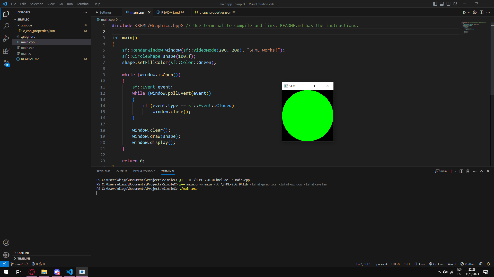

SimpleC - ENG  
Posting SFML libraries compilation. 64bit OS required.  
Making an easy game. No crazy graphics yet.  
Visual Studio Code - Extensions: 'C/C++ by Windows', 'Error Lens' and 'Prettier Code'.  
MYSYS2 ver 13.0.1 x64 architecture.  
SFML ver 2.6.0 x64.  
Terminal code for coompiling, linking and running respectively:  
g++ -IC:/SFML-2.6.0/include -c main.cpp // Change to your SFML/include path.  
g++ main.o -o main -LC:\SFML-2.6.0\lib -lsfml-graphics -lsfml-window -lsfml-system // Same here to ../lib  
./main.exe  

SimpleC - ESP  
Publicando sobre Librerias SFML compiladas. Requiere SO de 64bit.  
Haciendo un juego sencillo. Sin graficas locas por el momento.  
Visual Studio Code - Extensiones: 'C/C++ de Windows', 'Error Lens' y 'Prettier Code'.  
MYSYS2 ver 13.0.1 x64. Opcional en el sentido que pueden bajar cualquier compilador.  
SFML ver 2.6.0 x64.  
Codigos para compilar, vincular y correr respectivamente:   
g++ -IC:/SFML-2.6.0/include -c main.cpp // Cambiar ruta a su SFML/include  
g++ main.o -o main -LC:\SFML-2.6.0\lib -lsfml-graphics -lsfml-window -lsfml-system // Igual aqui a ../lib  
./main.exe  

